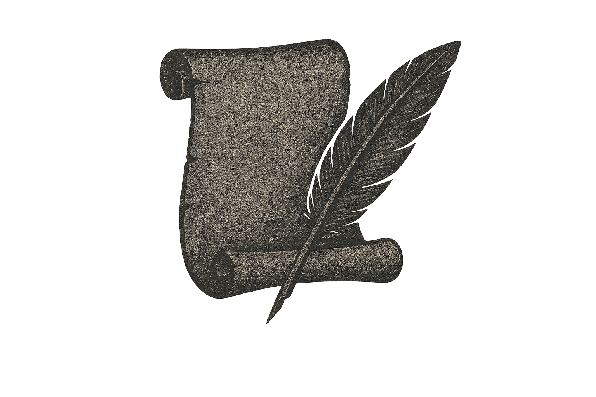

<h1 align='center'>THE LORE</h1> 
<h2 align='center'>"Donde las historias de tus juegos favoritos cobran realidad”</h2>

   <!-- Version del proyecto -->
   <!-- Creador del proyecto -->
   <!-- Estado del proyecto -->

## ❕Recursos usados:

  
  
  
  
  
  
  
  
  <!--  -->
  <!--  -->

## 📖 Documentación:  <a href="https://github.com/jserfra2809/the-lore/wiki">Wiki</a>
